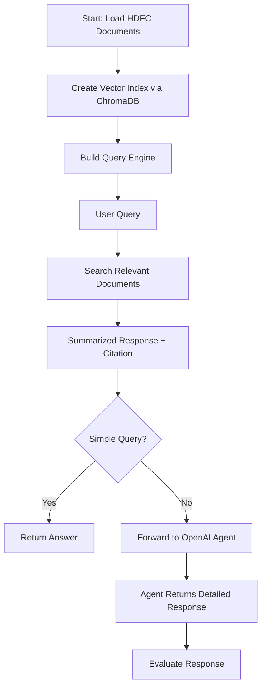

---

# 📄 Policy Search AI: Semantic Spotter on HDFC Policy Documents

## Overview

This project develops an intelligent semantic search system that can query HDFC policy documents, retrieve relevant information, and respond with trustworthy, citation-supported answers. It also includes agent integration for handling complex queries and evaluating the quality of responses.

---

## 🛠️ Features

- **Semantic Search** over HDFC policy documents
- **Agent-based Query Handling** for detailed reasoning
- **Citations** included in responses
- **Faithfulness & Relevancy Evaluations** of answers
- **Flow Diagram** explaining system architecture
- **Future enhancements** for scaling and better performance

---

## 🚀 Quick Start

### 1. Install Required Libraries

```bash
pip install llama-index openai chromadb
```

### 2. Setup Environment

- Mount Google Drive (if using Colab)
- Set OpenAI API Key

```python
from google.colab import drive
from google.colab import userdata
import os
import openai

drive.mount('/content/drive')
openai.api_key = userdata.get('OPENAI_KEY')
os.environ['OPENAI_API_KEY'] = openai.api_key
```

### 3. Load Policy Documents

```python
from llama_index.core import SimpleDirectoryReader
reader = SimpleDirectoryReader(input_dir="/path_to_policy_docs")
documents = reader.load_data()
```

### 4. Create Vector Index with ChromaDB

```python
import chromadb
from llama_index.vector_stores.chroma import ChromaVectorStore
from llama_index.core import StorageContext, VectorStoreIndex

db = chromadb.PersistentClient(path="./chroma_db")
collection = db.get_or_create_collection("HDFC_policy")
vector_store = ChromaVectorStore(chroma_collection=collection)
storage_context = StorageContext.from_defaults(vector_store=vector_store)
index = VectorStoreIndex.from_documents(documents, storage_context=storage_context)
```

### 5. Build Query Engine

```python
query_engine = index.as_query_engine()
```

### 6. Setup OpenAI Agent

```python
from llama_index.agent.openai import OpenAIAgent
from llama_index.core.tools import QueryEngineTool

search_tool = QueryEngineTool.from_defaults(
    query_engine=query_engine,
    name="policy_document_search",
    description="Useful for answering HDFC Policies related queries"
)

agent = OpenAIAgent.from_tools(tools=[search_tool], llm=OpenAI(model="gpt-3.5-turbo", temperature=0.0), verbose=True)
```

### 7. Query and Evaluate

```python
query = "What is the best life cover policy?"
response = agent.chat(query)

# Evaluate
from llama_index.core.evaluation import FaithfulnessEvaluator, RelevancyEvaluator

evaluators = {
    "faithfulness": FaithfulnessEvaluator(llm=OpenAI(model="gpt-3.5-turbo")),
    "relevancy": RelevancyEvaluator(llm=OpenAI(model="gpt-3.5-turbo")),
}
results = {name: evaluator.evaluate_response(query=query, response=response) for name, evaluator in evaluators.items()}
```

---

## 🧠 Solution Strategy

- Load and preprocess HDFC policy documents.
- Create dense vector representations using ChromaDB.
- Build a semantic query engine.
- For simple queries, directly return responses.
- For complex queries, delegate to OpenAI Agent for chain-of-thought reasoning.
- Evaluate responses for faithfulness and relevancy to ensure trustworthiness.

---

## 📈 Flow Diagram



---

## 🔥 Future Enhancements

- Clean and enrich policy documents for better semantic matching.
- Use GPT-4 or domain-specific LLMs for improved reasoning.
- Develop a web app UI.
- Implement multi-agent collaboration (health insurance, accident insurance, etc.).
- Introduce human-in-the-loop review for critical responses.

---

## 📚 References

- [LlamaIndex Documentation](https://docs.llamaindex.ai)
- [OpenAI API Documentation](https://platform.openai.com/docs)
- [ChromaDB Documentation](https://docs.trychroma.com/)
- [Google Colab Documentation](https://colab.research.google.com/)

---